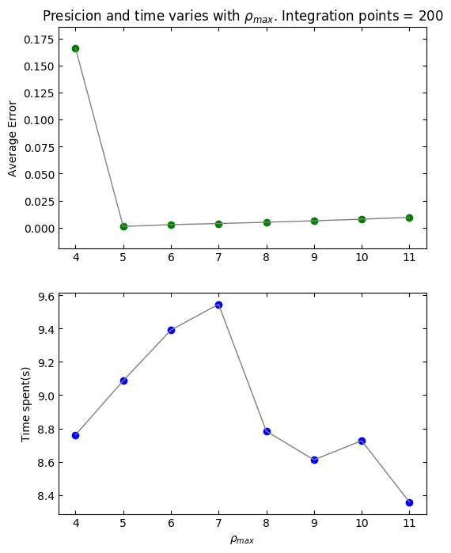

# 1. Abstract
This paper first solves a buckling beam problem as a classical wave function problem in one dimension. Thereafter we extend the problem to quantum mechanics where electrons move in a three dimensional harmonic oscillator potential. We solve these problems as an eigenvalue problem with three different methods; the Jacobi method, the bisection method and Armadillos eigenvalue solver.

Our algorithm for Jacobi is rather inefficient when dealing with matrices larger than 200 x 200, though having an increasing precision when increasing the size(seen in int-points-plot.png). The bisection is a really simple and efficient method with a set precision. On the other hand it will not find the eigenvectors. Compared to Jacobi it was found to be about 530 times faster(0.14 seconds for Bisection and 86 seconds for Jacobi) for a 200 x 200 matrix.

Scaling of the equations in order to make them dimensionless is an important part of this project. One reason is to reduce numerical error(round off) when e.g. adding or subtracting small numbers many times. It also makes the behavior of the system more general.


# 2. Introduction
This project aims to look at different numerical methods for solving eigenvalue problems, which is relevant in many areas of physics, especially when solving differential equations. In this project we will also explore the eigenvalue solver's value specifically, with a classical case - the buckling beam problem - and a quantum case - electrons as quantum dots.

We will solve the following equation:

$$
-\frac{d^2u(\rho)}{d\rho^2}=\lambda u(\rho)
$$

where $\rho$ and $\lambda$ are the scaled values from a given differential equation representing a physical system.
<!-- TODO: Jacobi's method -->

<!-- TODO: Scaling functions and quantum case -->

<!-- TODO: Bisection method -->

The eigenvalue algorithm mainly explored in this paper is the Jacobi eigenvalue algorithm first proposed by Carl Gustav Jacob Jacobi. He proposed this algorithm already in 1846 [@Jacobi], but it only became widely used with the rise of the computer in the 1950s.

In addition to the Jacobi method for eigenvalues, we will also compare this to a somewhat simpler method. This utilizes bisection to find the roots corresponding to the eigenvalues, which should be more effective.


# 3. Theory and technicalities

## 3.1 The problem

In this project, we are considering two wave function problems in one dimension. Generally, the differential equation we are to solve can be written like this:

$$-\frac{d^2u(\rho)}{d\rho^2}=\lambda u(\rho).$$  {#eq:diffeq}

This equation can be applied to both problems by making $\rho$ and $\lambda$ appropriate scaled values for the system in question.

### Buckling beam

<!-- TODO: More on the buckling beam problem -->

For the buckling beam, we are solving this differential equation:

$$\gamma d^2 \frac{u(x)}{dx^2} = -F u(x),$$ {#eq:bucklingbeam}

where
- the length of the beam is $L$.
- $x\in[0,L]$ denotes the distance along the beam.
- $u(x)$ is the vertical displacement in y -direction.

$\gamma$, F and L are known variables. We say that the scaled value $\rho=\frac{x}{L}$,making the variable $\rho$ defined in $[0,1]$. The boundary conditions for the scaled function $u(\rho)$ are now $u(0)=u(1)=0$ - nice and general.

We can now rewrite @eq:bucklingbeam as:

$$
-\frac{d^2 u(\rho)}{d\rho^2}=\lambda  u(\rho), \qquad \lambda = \frac{FL^2}{R}.
$$

### Quantum case

In the quantum case of the differential equation, we have one or two electrons as quantum dots in a 3-dimensional space, both stuck in a harmonic oscillator potential. They repel eachother by the static Coloumb interaction and we assume spherical symmetry. Their dynamics are represented by the radial part of the Schrödinger equation:

$$
  -\frac{\hbar^2}{2m}\left(\frac{1}{r^2}\frac{d}{dr}r^2\frac{d}{dr} - \frac{l(l+1)}{r^2}\right) R(r) + V(r)R(r) = ER(r)
$$

where $V(r)$ is the harmonic oscillator potential $\frac{1}{2}kr^2$ with $k=m \omega^2$ and E is the energy of the harmonic oscillator. The quantum number $l$ is the orbital momentum of the electron, the oscillator frequency is $\omega$ and its energies are:

$$
  E_{nl} = \hbar \omega \left(2n + l + \frac{3}{2} \right),\qquad n = 0,1,2,...,\qquad l = 0, 1, 2, ...
$$

The radial position has boundary conditions $u(0)=u(\infty)=0$. Since this is already transformed to spherical coordinates, we have $r \in [0, \infty)$. If we substitute $R(r) = \frac{1}{r}u(r)$ we get

$$
  -\frac{\hbar}{2m}\frac{d^2}{dr^2}u(r) + \left( V(r) + \frac{l(l+1)}{r^2}\frac{\hbar^2}{2m}\right)u(r) = Eu(r).
$$

Moving on, we introduce a dimensionless variable $\rho$ which contains a variable $\alpha$ which we can define later.

If $\rho = \frac{1}{\alpha} r$ the equation reads:

$$
  -\frac{\hbar^2}{2m\alpha^2}\frac{d^2}{d\rho^2}u(\rho) +  \left( V(\rho) + \frac{l(l+1)}{\rho^2}\frac{\hbar^2}{2m\alpha^2}\right)u(\rho) = Eu(\rho)
$$

Multiplying both sides by $2m\alpha^2/\hbar^2$ we get

$$
  -\frac{d^2}{d\rho^2}u(\rho) + \frac{mk}{\hbar}\alpha^4\rho^2u(\rho) = \frac{2m\alpha^2}{\hbar^2}Eu(\rho).
$$

We can now fix the constant $\alpha$ to eliminate all the constants

$$
\frac{mk}{\hbar^2}\alpha^2 = 1 \hspace{1cm} \rightarrow \hspace{1cm} \alpha = \left(\frac{\hbar^2}{mk}\right)^{1/4}.
$$

If we now define

$$
  \lambda = \frac{2m\alpha^2}{\hbar^2}E,
$$

the Schroedinger's equation can be rewritten as

$$
  -\frac{d^2u(\rho)}{d\rho^2} + \rho^2u(\rho) = \lambda u(\rho),
$$

which is solvable by an eigenvalue solver. The difference this time, however, is the added potential $\rho^2u(\rho)$.

## 3.2 Orthogonal transformations

A unitary matrix $\mathbf{Q}$ has this property:

$$
  \mathbf{Q}^\dagger\mathbf{Q}=\mathbb{I}\Rightarrow \mathbf{Q}^\dagger=\mathbf{Q}^{-1}
$$

where $\mathbb{I}$ is the identity.

Unitary transformations are key to the method we are implementing, so we need to make sure that they preserve the orthogonality of the eigenvectors we apply it on. Our starting basis being orthogonal is more formally written like this:

$$
  \mathbf{v}_j^T \mathbf v_i = \delta_{ij}.
$$

Applying our unitary matrix on these, transforms them into a new basis

$$
  \mathbf{w}_i=\mathbf{Qv}_i.
$$

Multiplying the above equation from the left with $\mathbf{w}_j^T=(\mathbf{Q} \mathbf{v}_j)^T$, we get

$$
  \mathbf{w}_j^T\mathbf{w_i}=(\mathbf{Q} \mathbf{v}_j)^T \mathbf{Qv}_i\\
$$

$$
  \mathbf{w}_j^T\mathbf{w_i}=\mathbf{v}_j^T\mathbf{Q}^T \mathbf{Qv}_i\\
$$

Since $\mathbf{Q^TQ} = \mathbb I$,

$$
\mathbf{w}_j^T\mathbf{w_i}  = \mathbf{v}_j^T\mathbf{v_i} = \delta_{ij}.
$$

This means our unitary transformation preserves the orthogonality of our basis.

## 3.3 Jacobi's method

The Jacobi eigenvalue method is an iterative method for finding eigenvalues. It is based on the idea of doing a number of unitary basis transformations on the matrix in question, with the goal of diagonalizing it.

$$
  \mathbf{Q}_n^\dagger\mathbf{Q}_{n-1}^\dagger...\mathbf{Q}_1^\dagger\mathbf{A}\mathbf{Q}_1...\mathbf{Q}_{n-1}\mathbf{Q}_n=\mathbf{D},
$$

where $\mathbf{A}$ is the starting matrix, $\mathbf{Q}_i$ are unitary matrices and $\mathbf{D}$ is diagonal, containing the eigenvalues.

Quickly jumping back to our original differential equation (@eq:diffeq), we first discretize it:

$$
  -\frac{u(\rho_i + h) - 2 u(\rho_i) + u(\rho_i - h)}{h^2}  = \lambda u(\rho_i),
$$

where $h$ is the step size. Or more compactly,

$$
  -\frac{u_{i+1} - 2 u_i + u_{i-1}}{h^2}  = \lambda u_i.
$$

The set of all equations from $u_1$ to $u_{N-1}$ can be written as the eigenvalue equation (the endpoints, $u_0$ and $u_N$, are not included):

$$
\mathbf{Au = \lambda u}.
$$ {#eq:one}

Here $\mathbf{A}$ is a tridiagonal matrix and $\mathbf{u}$ contains all the function values.

$$
\mathbf A =\left[\begin{matrix}
    d   &  a   &  0   &   0   &   \dots   &   0  &  0  \\
    a   &  d   &  a   &   0   &   \dots   &   0  &  0  \\
    0   &  a   &  d   &   a   &    0      &   \dots & 0 \\
    \dots & \dots & \dots & \dots & \dots & \dots & \dots\\
    0   &  \dots & \dots & \dots &    a   &     d & a   \\
    0   &  \dots & \dots & \dots &  \dots &     a & d   \\
\end{matrix}\right]
\qquad \text{and} \qquad
\mathbf u =\begin{bmatrix}
    u_1 \\   u_2 \\ u_3 \\  \dots \\ u_{N-2} \\ u_{N-1}
\end{bmatrix}
$$ {#eq:tridiag}

The diagonal $d = \frac{2}{h^2}$ and the non-diagonal $a = -\frac{1}{h^2}$.

Now we can solve our equation numerically using Jacobi's method and compare with the analytical eigenvalues:

$$
\lambda_i = d + 2a \cos (\frac{j \pi}{N+1}) \qquad j = 1, 2, \dots, N.
$$ {#eq:two}

<!-- Oppgave 2b) -->

In order to solve equation @eq:one we implement Jacobi's rotation algorithm. In our Jacobi method we define the following:

$$
\tan\theta = t = s/c,\\
s = \sin\theta,\\
c = cos \theta,\\
\cot 2\theta = \tau = \frac{a_{ll}-a_{kk}}{2a_{kl}}.
$$

We define $\theta$ so all non diagonal elements of the transformed matrix become zero. Since

$$\cot2\theta = \frac{1}{2}(\cot\theta-\tan\theta)\\$$

We can rewrite as..
$$t^2 + 2\tau t - 1 = 0 , $$
giving
$$t = -\tau \pm \sqrt{1+\tau^2}.$$
Then
$$c = \frac{1}{\sqrt{1+t^2}} \quad \textrm{and} \quad s= tc$$


kilde til oppgave 2 a): http://www.math.harvard.edu/archive/21b_spring_08/handouts/orthomatrix.pdf

## 3.4 Our method applied

To solve the buckling beam problem, the approach is quite straight forward. Our solver finds the eigenvalues $\lambda$, which gives the values of interest.

For the quantum dots, however, some modification is necessary. The compact discretized Schroedinger equation will be

$$
  -\frac{u_{i+1} - 2u_i + u_{i-1}}{h^2} + V_i u_i = \lambda u_i,
$$

where $V_i = \rho_i^2$ and $h$ is the steplength.
From this it is clear that on tridiagonal matrix form it is written
$$
  \left(\begin{matrix}
      d_i   &  e_i   &  0   &  \dots    &   \dots   &   \dots  &  0  \\
      e_i   &  d_i   &  e_i   &   0   &   \dots   &  \dots   &  0  \\
      0   &  e_i   &  d_i   &   e_i   &    0      &   \dots & 0 \\
      \vdots & 0 & \ddots & \ddots & \ddots &  & \vdots\\
      \vdots   &  \vdots &  & 0 &    e_i   &     d_i & e_i   \\
      0   &  \dots & \dots & \dots &  0 &     e_i & d_i   \\
  \end{matrix}\right)
  \left(\begin{matrix}
      u_1 \\   u_2 \\ u_3 \\  \vdots \\ u_{N-2} \\ u_{N-1}
  \end{matrix}\right)
  = \lambda \left(\begin{matrix}
      u_1 \\   u_2 \\ u_3 \\  \vdots \\ u_{N-2} \\ u_{N-1}
  \end{matrix}\right)
$$
with the diagonal elements $d_i = \frac{2}{h^2} + V_i$ and the non-diagonal elements $e_i = -\frac{1}{h^2}$.

It is now clear that the eigenvalue solver we made will be able to find these eigenvalues. However it will have to be tweaked by finding a sufficient number of integration points, $N$ and an approximation of $\rho_{max}$ to infinity that yields eigenvalues close enough to the analytical ones of which the first four are $\lambda = 3,7,11,15$.

With these eigenvalues it is possible to calculate the energy and position of the electron, but we will not demonstrate that here. We will instead investigate what number of integration points, $N$, and what approximation of infinity we can use to get sufficiently precise eigenvalues.

To do this we fix $\rho_{max} = 10$ and find the average deviation of our calculated eigenvalues from the analytical eigenvalues, for $N = {100, 200, 300, 400}$. We thereafter plot the error and time versus the number of integration points. This can be found in the project repository in [/Code/Quantum-case/main.cpp](https://github.com/amundmr/Project-2/blob/master/Code/Quantum-case/main.cpp)

Then we fix the number of integration points to $N = 200$ and calculate the average error for the approximations $\rho_{max} = {4, 5, 6, 7, 8, 9, 10, 11}$ and plot the error and time versus the approximation of $\rho_{max}$. This can be found in the project repository in [/Code/Quantum-case/main_rho.cpp](https://github.com/amundmr/Project-2/blob/master/Code/Quantum-case/main_rho.cpp)

## 3.5 Using bisection

Bisection is a method of finding the roots of a polynomial. As an alternative to the Jacobi method, we generate the characteristic polynomial $P_A$ of the tridiagonal matrix in question and find the roots of it. These are the eigenvalues we seek. With the tridiagonal matrix defined in eq. (@eq:tridiag), $P_{A,n}$ is the characteristic polynomial of a matrix of size $n$.

$$
  P_{A,n}(\lambda)=(d-\lambda)P_{A,n-1}(\lambda)-aP_{A,n-2}(\lambda), \qquad P_{A,0}(\lambda)=1, \qquad P_{A,1}(\lambda)=d-\lambda
$$

Our approach to finding roots of this polynomial involves testing over several sub-domains $[a,b]$. In every sub-domain we do bisection. This is simply defining a midpoint $c$ and checking which of the domains $[a,c]$ and $[c,b]$ contain a root (if any). If, for example $f(a)*f(c)<0$, we conclude that a root is in $[a,c]$ ($f(a)$ and $f(c)$ have different signs). We obviously also check if $c$ is a root. This procedure is done until we are sufficiently close to the root we are seeking. @Hjorth-Jensen2010

# 4. Results

## 4.1 Buckling beam problem

Our program [*/Code/Buckling_beam/*](https://github.com/amundmr/Project-2/tree/master/Code/Buckling_beam) gives these eigenvalues for a matrix of size $N=10$:

```
0.0810
0.3175
0.6903
1.1692
1.7154
2.2846
2.8308
3.3097
3.6825
3.9190
```

These correspond both with the eigenvalues from armadillos diagonalizer and with the analytical ones. Time spent on the different solvers as well as the maximum non-diagonal element and number of rotations can be found by running the program [main.exe](https://github.com/amundmr/Project-2/blob/master/Code/Buckling_beam/main.exe).

## 4.2 Quantum mechanics eigenvalue calculations

The investigation of a sufficient amount of integration points $N$, with the program in [/Code/Quantum-case/](https://github.com/amundmr/Project-2/tree/master/Code/Quantum-case), gave us the plot shown in figure @fig:qfig1.

{#fig:qfig1}

The investigation of the best approximation to infinity gave us the plot shown in figure @fig:qfig2.

{#fig:qfig2}

It is also worth noting that all these graphs are reproducible, except the time graph of the approximation of $\rho_{max}$ which were very different every time.

## 4.3 Jacobi v. bisection

The program in [/Code/Bisection/](https://github.com/amundmr/Project-2/tree/master/Code/Bisection) compares the speed of the Jacobi method against finding the eigenvalues as roots of the characteristic polynomial with bisection. With $N=200$, we get these quite staggering results:

```
Time spent on bisection method: 0.140625 s
Time spent on Jacobi method: 86.875 s
```

Even though $N=200$ is quite a realistic number of steps (maybe even a bit few, in cases), the bisection method blazes ahead.

# 5. Discussion

## 5.2 Quantum mechanics eigenvalue calculations
From the figures(@fig:qfig1, @fig:qfig1) presented in the results we see that while a higher number of integration points yields better results, though also rapidly increasing time.

With the changing of $\rho_{max}$ we see that first the error decreases, but after $\rho_{max} = 5$ we actually start to see an increase in error again. This might be because a higher $\rho_{max}$ gives a bigger step-size which again gives lower numbers on the off-diagonal elements, which in turn yields fewer Jacobi rotations before the off-diagonal elements are below the tolerance for being called zero.

The time spent on the calculations seem pretty random and that is probably because the changing of $\rho_{max}$ doesn't make the computer do any more or less work, it simply changes the numbers. The fluctuations might therefore just be that the computer has different background tasks running at different times.


# 6. Conclusion
##6.? Future work


# Appendix

[GitHub Repository](https://github.com/amundmr/Project-2) - The source code and all the executables are in the folder [/Code/](https://github.com/amundmr/Project-2/tree/master/Code).

# References
{#refs}
